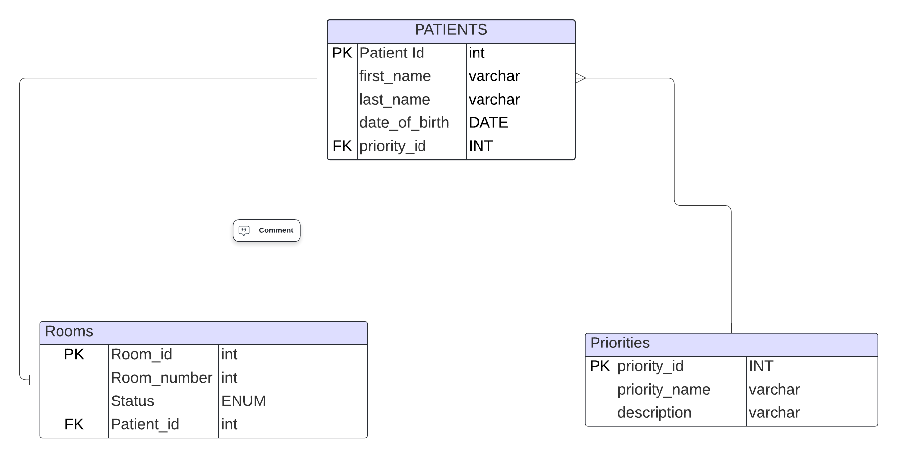

# Hospital Triage Database Design

## Entities and Attributes

### 1. Patients
- **Description**: Stores details about patients in the hospital system.
- **Attributes**:
  - `patient_id` (INT, PRIMARY KEY, AUTO_INCREMENT): Unique identifier for each patient.
  - `first_name` (VARCHAR(50), NOT NULL): Patient's first name.
  - `last_name` (VARCHAR(50), NOT NULL): Patient's last name.
  - `date_of_birth` (DATE, NOT NULL): Patient's date of birth.
  - `priority_id` (INT, FOREIGN KEY referencing `Priorities(priority_id)`): Links the patient to a triage priority level.

### 2. Priorities
- **Description**: Represents triage priority levels for patients.
- **Attributes**:
  - `priority_id` (INT, PRIMARY KEY, AUTO_INCREMENT): Unique identifier for each priority.
  - `priority_name` (VARCHAR(30), UNIQUE, NOT NULL): Name of the priority level (e.g., Critical, Moderate).
  - `description` (TEXT): Optional description of the priority level.

### 3. Rooms
- **Description**: Tracks hospital room information and assignments.
- **Attributes**:
  - `room_id` (INT, PRIMARY KEY, AUTO_INCREMENT): Unique identifier for each room.
  - `room_number` (VARCHAR(10), NOT NULL, UNIQUE): Room number (e.g., A101, B202).
  - `status` (ENUM('Available', 'Occupied'), DEFAULT 'Available'): Current status of the room.
  - `patient_id` (INT, FOREIGN KEY referencing `Patients(patient_id)`): Links the room to the assigned patient.

---

## Relationships

### Patients ↔ Priorities
- **Type**: Many-to-One.
- **Description**: Each patient is assigned one priority level, but multiple patients can share the same priority.
- **Keys**:
  - `Patients.priority_id` → `Priorities.priority_id`.

### Patients ↔ Rooms
- **Type**: One-to-One.
- **Description**: Each patient can be assigned to one room, and each room can accommodate one patient at a time.
- **Keys**:
  - `Rooms.patient_id` → `Patients.patient_id`.

---

## Database Schema Visualization

---

 