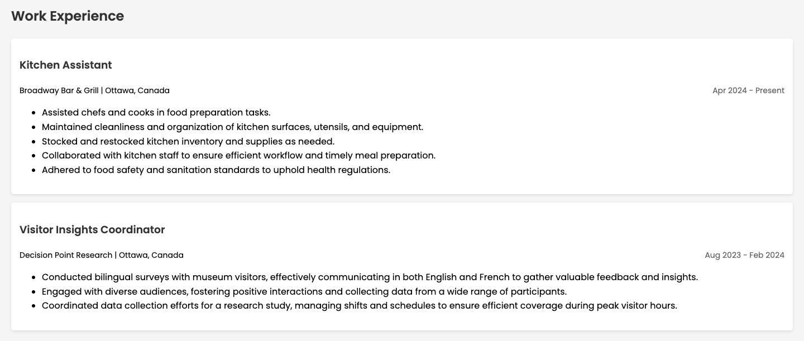

 # Chris Mugabo's Portfolio

Welcome to my portfolio! This project showcases my technical skills, education, and work experience. Below is a detailed breakdown of the design and structure of my portfolio website.

## Table of Contents

1. [Design Overview](#design-overview)
2. [Color Palette](#color-palette)
3. [Typography](#typography)
4. [Components and Layout](#components-and-layout)
5. [Sections](#sections)
6. [Footer](#footer)
7. [Credits](#credits)

---

## Design Overview

The portfolio follows a clean, minimalist design that prioritizes readability and user experience. The color palette and typography are carefully selected to convey professionalism while maintaining a friendly and approachable tone. The structure is easy to navigate, with a clear header, navigation bar, content sections, and footer.

---

## Color Palette

The website uses a modern color scheme that emphasizes contrast and clarity:

- **Primary Color**: `#2d3032` (Dark Gray)
- **Text Color**: `#e8ecf1` (Stylish Blue for links)
- **Background Color**: `#F5F5F5` (Light Gray)
- **Accent Color**: `#292423` (Dark Orange)

---

## Typography

The website uses the **Poppins** font family throughout the design to maintain a modern and clean look:

- **Body Text**: 'Poppins', sans-serif
- **Header Text**: 'Poppins', sans-serif, bold for emphasis

---

## Components and Layout

### 1. **Header**
   - The header includes my name, address, email, and phone number.
   - The background color is dark gray, with white text for better contrast.
   - All content is centered for a balanced and organized look.
   - **Mock-up Screenshot**:
     

### 2. **Navigation Bar**
   - The navigation bar contains links to important sections like Summary, Skills, Education, and Experience.
   - It has a dark gray background and white text for easy visibility.
   - Links change style on hover to enhance user interaction.
   - **Mock-up Screenshot**:
     

### 3. **Content Sections**
   - Each section (Summary, Skills, Education, Experience) is visually separated to maintain clarity.
   - The **Summary** section highlights key strengths, while **Skills** details my technical knowledge.
   - The **Education** and **Work Experience** sections include details about my academic background and job roles, with the dates right-aligned for easy scanning.
   - **Mock-up Screenshot**:
     
     
      

### 4. **Footer**
   - The footer includes a link to my [LinkedIn Profile](https://www.linkedin.com/in/chris-mugabo/) and copyright information.
   - **Mock-up Screenshot**:
     

---

## Sections

### 1. **Summary**
   A brief overview of my professional background, showcasing my skills in programming, software development, and communication.

### 2. **Technical Skills & Knowledge**
   This section lists the programming languages and tools I'm proficient in, including:
   - **Languages**: Java, Python, C++
   - **Web Development**: HTML, CSS, JavaScript
   - **Database Management**: SQL
   - **Graphic Design**: Adobe Photoshop

### 3. **Education**
   This section highlights my academic journey, including my current program at **Algonquin College** and my previous studies at **Trent University**. Details about relevant courses, projects, and achievements are provided.

### 4. **Work Experience**
   This section outlines my work experience, including roles like **Kitchen Assistant** and **Visitor Insights Coordinator**. Each job includes responsibilities and accomplishments, with a clear focus on relevant skills and achievements.

---

## Footer

The footer provides a link to my **LinkedIn profile** for easy connection and features copyright information.

---

## Credits

- Developed by **Chris Mugabo**
- HTML & CSS design following a minimalist and modern approach.
- Fonts sourced from [Google Fonts](https://fonts.google.com/).
- **Mock-up Screenshots**:
    - Header, Navigation, Content, and Footer mock-ups are included to demonstrate the design.

---

Feel free to explore the website, and thank you for visiting my portfolio!

